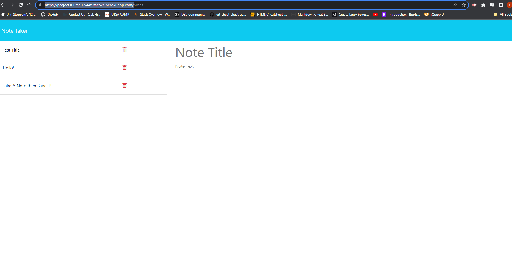

# Express NoteTaker

## Description:

-This project showcases our learned skills in using Express to run live severs, as well as showcase our ability to backend code.
    
## Description:

Note taker Application, with live Database.

## Table of Contents:

- [Description](#description)
- [Installation](#installation)
- [Usage](#usage)
- [Credits](#credits)
- [License](#license)
- [Tests](#tests)
- [Questions](#questions)

## Installation:

To install and run this project, you will need to install Express

## Usage:

Live Application will store notes for you, as well as let you delete notes that you previously created.

## Credits:

Cody Thompson , with help from Jason Mason and Bijan Olfati

## License:

N/a

## Tests:

No test written for this project.

## Questions / Links:

Contact Information

Github Link: https://github.com/codyleight

Email: codylthomp@gmail.com

Live Application on heroku: https://project10utsa-6544f6facb7e.herokuapp.com/

